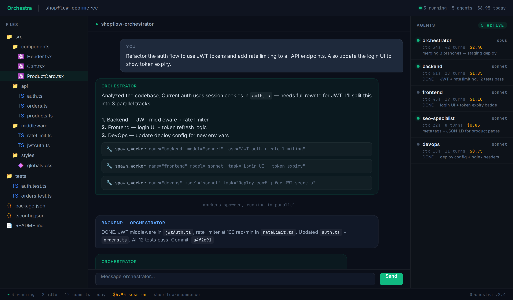
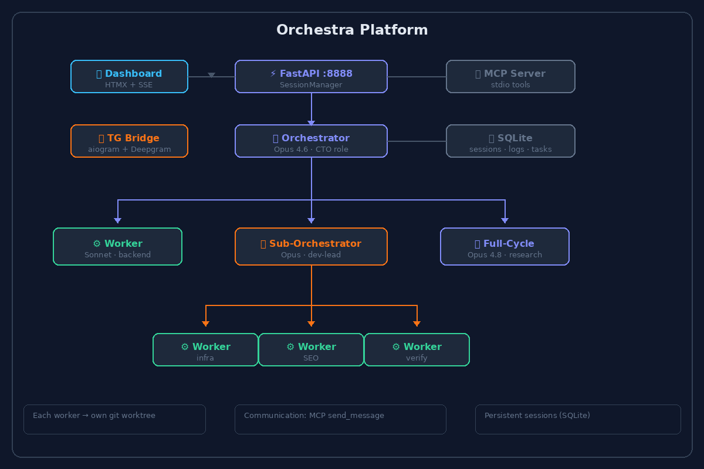
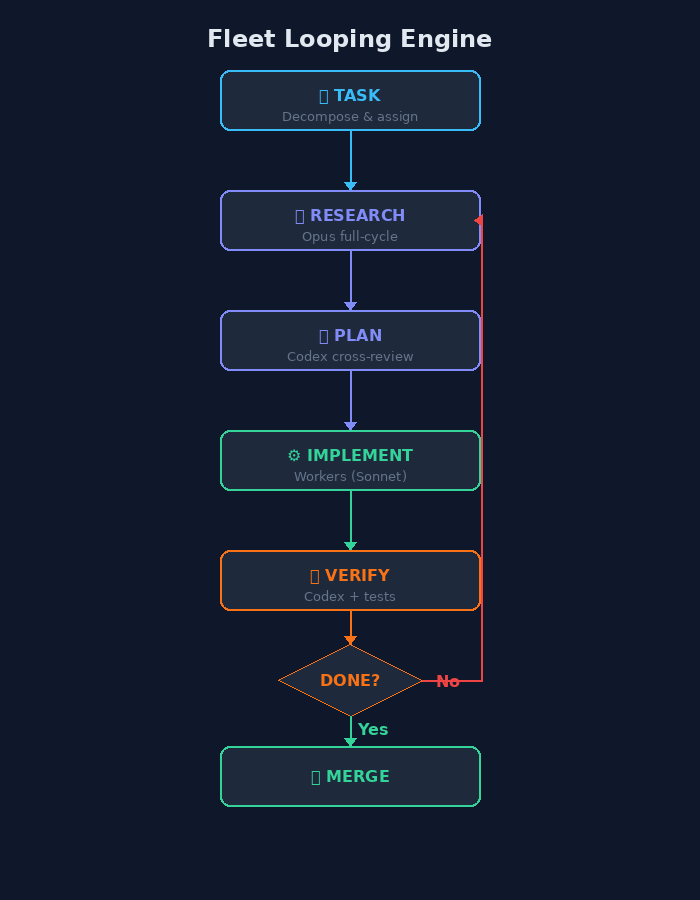

<p align="center">
  
</p>

# 🎼 Orchestra — AI Agent Orchestrator

[Changelog](CHANGELOG.md)

AI agent orchestrator. Opus orchestrator manages Sonnet/Haiku workers via MCP tools. Each worker in isolated git worktree. Persistent client sessions, real-time dashboard + Telegram bridge.

<p align="center">
  
</p>

## Quick Start

```bash
cp .env.example .env  # edit tokens
uv sync
uv run uvicorn app.main:app --host 127.0.0.1 --port 8888
# Open http://localhost:8888
```

## How It Works

1. **Create an orchestrator** — pick a project, model. Pill button in header
2. **Chat with it** — give tasks, it spawns workers automatically
3. **Workers work** — isolated git worktree, own branch, MCP communication
4. **See everything** — real-time SSE logs, context %, cache hit rate, usage bar
5. **Telegram** — optional TG bridge mirrors all activity to group topics

## Architecture

<p align="center">
  
</p>

```
Dashboard (HTMX+SSE) <-> FastAPI :8888 <-> SessionManager
                                            |-- Orchestrators (Opus, per-project)
                                            |     +-- spawn/send/stop/kill workers
                                            |-- Workers (Sonnet/Haiku, per-task)
                                            |     +-- send_message back to orchestrator
                                            +-- Cross-project messaging

TG Bridge (aiogram) <-> Orchestra API
                    <-> Telegram group with topics per orchestrator
                    <-> Bidirectional mirrors to other groups
```

## Fleet Looping — Multi-Level Agent Teams

Orchestra implements **fleet looping** — a hierarchical agent architecture where an orchestrator spawns specialized workers, each running in their own loop.

<p align="center">
  
</p>

- **Orchestrator** (Opus 4.6) — decomposes tasks, assigns workers, reviews results
- **Sub-Orchestrator** — manages a sub-team (e.g. dev-lead owns backend workers)
- **Full-Cycle Worker** (Opus 4.8) — research → plan → Codex review → implement → verify
- **System Worker** (Sonnet) — fast execution from clear specs
- **Cross-agent messaging** — workers can talk directly via `send_message`
- **Pipeline-as-config** — YAML manifests for custom roles per client

Each level loops: research → plan → execute → verify → iterate until done.

## Features

- **Persistent client per session** — connect once, `query()` injects mid-turn via SDK stdin. Auto-reconnect on failure
- **Heartbeat watchdog** — 60s heartbeat detects silent client death, auto-reconnects with inject notice
- **Auto-resume on restart** — all sessions (orchestrators + workers) restored from DB. Running sessions get restart notice injected
- **Auto-report** — workers that finish without send_message get force-reported to orchestrator
- **Prompt hot-reload** — updated prompts injected on first turn after restart
- **Cross-orchestrator awareness** — each orchestrator knows all others, can send_message across projects
- **Context tracking** — per-model limits (200k/1M), cache hit %, auto-compact at >90%
- **Usage bar** — OAuth API usage tracking, 5h/7d utilization, persisted cache
- **Worker progress tracking** — `update_progress(percent, status)` MCP tool, progress bar in sidebar
- **Stop vs Kill** — `stop_worker` = interrupt + idle (resumable), `kill_worker` = full delete
- **Image paste** — Ctrl+V upload with md5 dedup
- **Bug reports** — agents file bugs to BUGS.md via report_bug MCP tool
- **30+ custom tool bubbles** — spawn_worker, WebSearch, diff view, Read, Write, send_message, etc.

## Telegram Bridge (optional)

Mirror agent activity to a Telegram group with topic threads. Bidirectional — write in TG, agents receive with `[from TG: Name]` prefix.

1. Create a bot via [@BotFather](https://t.me/BotFather)
2. Create a TG group, enable topics, add your bot as admin
3. Add to `.env`:
   ```
   TG_BRIDGE_TOKEN=your_bot_token
   TG_BRIDGE_GROUP=your_group_id
   ```

### TG features
- **Voice/video notes** — Deepgram Nova-3 transcription, auto-injected as text
- **Media support** — photos, documents, video, audio, stickers, forwards with captions
- **Topic status** — 🟢/🟡 icons synced with actual agent status (single source of truth)
- **Mirror formatting** — entities (bold/italic/code) preserved in mirror groups
- **Images as photos** — `send_file` auto-detects images, sends via `send_photo` for inline preview
- **Debounce** — state machine batches rapid messages into single turn (5s window)
- **Polling auto-restart** — crash recovery wrapper with 10s retry

### Large file support (optional)
```bash
sudo bash scripts/setup-tg-bot-api.sh
# Add to .env:
TG_LOCAL_API_URL=http://localhost:8081
```

### Voice transcription (optional)
```
DEEPGRAM_API_KEY=your_key
```

## Task Manager

Built-in task management with priorities, payments, and YouGile sync.

- `task_create/update/list/get` — MCP tools for agents
- **Priorities** — critical 🔴, high 🟠, medium 🟡, low 🟢
- **Payments** — `payment_receive` auto-distributes to done tasks (smallest debt first)
- **YouGile sync** — bidirectional sync with YouGile boards (optional)
- **Payment journal** — auto-generated task in YouGile with payment history

## Security

- **Dashboard auth** — cookie session with login/password from `.env`
- **Internal token** — `INTERNAL_TOKEN` for MCP callback auth
- **Path traversal protection** — deny-list for dotfiles, credentials, databases
- **Upload restrictions** — executable extensions blocked
- **Limit caps** — SSE/logs capped to prevent abuse

## Deployment

Works locally and on remote VPS. See `docs/deploy-amsterdam/PLAN.md` for full deployment guide.

```bash
# .env for production
DASHBOARD_USER=admin
DASHBOARD_PASSWORD=your-secure-password
INTERNAL_TOKEN=your-random-hex-32
COOKIE_SECURE=1  # enable after SSL
```

## Stack

- Python 3.12+, FastAPI, Jinja2, SSE
- `claude-agent-sdk` — Claude Code SDK (persistent client per session)
- SQLite (WAL mode), git worktrees
- Tailwind CSS, highlight.js, marked.js, DOMPurify, diff-match-patch (bundled offline)
- aiogram 3.x (TG bridge)

## License

[AGPL-3.0](LICENSE) — free for open source. Commercial licensing available from [Seedon](https://seedon.ru) (ООО «Сидон»). Contact: maxim-as@bk.ru
